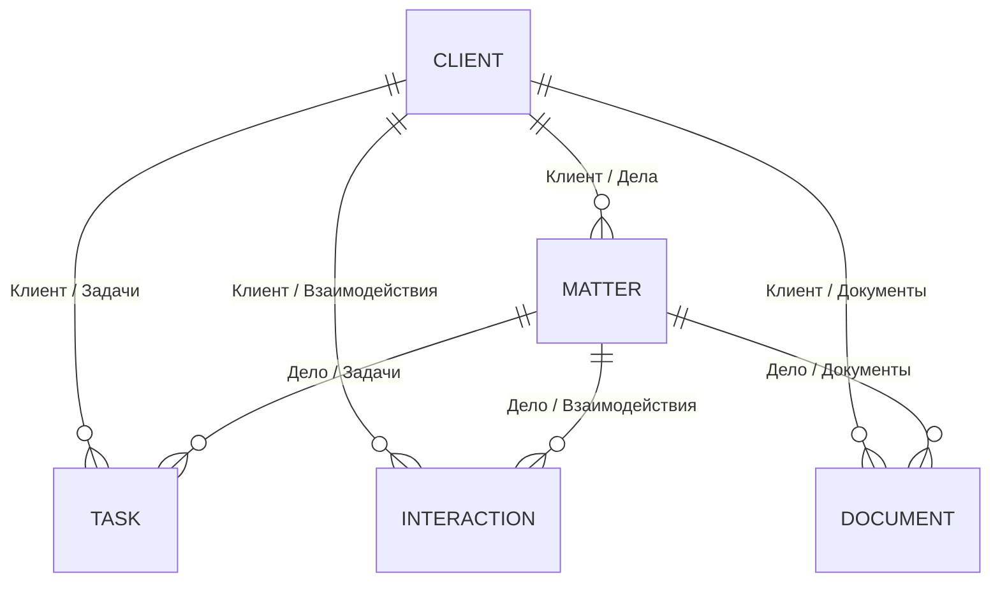

# Доменный контракт базы «Досье»

Статус: спецификация текущего состояния  
Дата снимка: 2026-09-11, часовой пояс Asia/Almaty  
Base ID: `bse6xtMPIwOTxR4jJqb`  
Приложение: `appSRc0YpmohorJdBlj` («Досье»)

## 1. Назначение документа

Документ описывает текущую модель данных, подтверждённое поведение приложения и требования к безопасному слою доступа. Он не задаёт конкретный HTTP, RPC или MCP-протокол. По нему можно реализовать разные транспорты, сохраняя одинаковую семантику операций.

Снимок не заменяет runtime-интроспекцию Teable. Перед записью интеграционный слой обязан получать актуальную схему или проверять её версию: поля и Views могут изменяться через Teable и через текущее приложение.

### 1.1. Маркировка утверждений

- **[S] Schema**: правило непосредственно обеспечивается текущей схемой Teable.
- **[A] App**: правило реализовано текущим приложением, но не схемой.
- **[O] Observed**: правило соблюдается текущими данными, но нигде не обеспечивается.
- **[G] Guardrail**: обязательная защитная мера будущего слоя доступа, не новое бизнес-правило.
- **[U] Undefined**: бизнес-семантика не определяется текущей системой и требует решения владельца.

Нельзя повышать правило `[O]` или `[A]` до доменного инварианта без явного решения.

## 2. Общая модель

База содержит пять таблиц:

| Сущность | Table ID | Назначение |
|---|---|---|
| Клиенты | `tblnRVk5GfCN2JNEovH` | Карточка физического лица или организации, контактные и идентификационные данные, статус отношений и конфликт-чек. |
| Дела | `tblLwuSd3PSx2WuXLjm` | Юридическое поручение/материя клиента: стадия, категория, суд, сроки, гонорар и противная сторона. |
| Задачи | `tblzFRUTxwbMTXyIeNM` | Рабочие действия юриста, связанные с клиентом и/или делом. |
| Взаимодействия | `tblo7bC4S6ytz3Gnb7b` | Журнал контактов, встреч, сообщений и судебных событий с результатом и следующим шагом. |
| Документы | `tblKDlLAQ8nGwo0qlYW` | Метаданные юридических документов и, при наличии, прикреплённые файлы. |

Текущий объём данных на дату снимка: 10 клиентов, 16 дел, 32 задачи, 30 взаимодействий, 30 документов.

## 3. Идентификаторы и уникальность

1. **[S]** Канонический идентификатор записи - Teable record ID вида `rec...`. Только он должен использоваться для адресации, ссылок, обновлений и удалений.
2. **[S]** Канонические идентификаторы таблиц и полей - `tbl...` и `fld...`. Display name и `dbFieldName` изменяемы и не являются стабильным контрактом.
3. **[S]** Идентификатор пользователя - `usr...`; Link и User значения должны передаваться по ID, а не по отображаемому имени.
4. **[S]** У всех текущих бизнес-полей `unique: false`. Ни имя клиента, ни телефон, ни email, ни ИИН/БИН, ни номер дела не являются уникальными на уровне Teable.
5. **[O]** В текущем наборе нет дублей имени клиента, телефона, email, ИИН/БИН и заполненного номера дела. Это свойство данных, а не ограничение.
6. **[G]** Повторяемые команды создания должны иметь отдельный idempotency key. Бизнес-поля нельзя использовать как неявный ключ идемпотентности.
7. **[U]** Не определено, должны ли ИИН/БИН, email, телефон или номер дела быть уникальными, и в какой области: глобально, по типу клиента, по суду или по году.

## 4. Обязательность и null-семантика

- **[S]** Ни одно поле в пяти таблицах не объявлено `notNull: true`.
- **[S]** В каждой таблице есть Primary field, но его значение не объявлено обязательным и не уникально. Primary означает поле-заголовок записи, а не бизнес-ключ.
- **[A]** UI при создании клиента пишет переданное имя, а после trim подставляет «Новый клиент», если строка пустая.
- **[S]** Для partial update отсутствие поля означает «не изменять»; явное `null` означает очистку, если тип поля допускает пустое значение.
- **[G]** Интеграционный слой обязан различать omitted и `null`. Нельзя превращать отсутствующий ключ в очистку.
- **[U]** Бизнес-обязательность полей по сущностям не утверждена. Текущая заполненность не является достаточным основанием сделать поля обязательными.

## 5. Таблица «Клиенты»

Table ID: `tblnRVk5GfCN2JNEovH`.

| Поле | Field ID | Тип | Запись извне | Семантика и текущие ограничения |
|---|---|---|---|---|
| Клиент | `fldYoptHjzf9ctp9hLW` | `singleLineText`, Primary | Да | Отображаемое имя физлица или организации. Nullable, не уникально. |
| Телефон | `fldThxhxNmnp2YFhr9O` | `singleLineText` | Да | Контактный номер как произвольный текст. Формат и уникальность не проверяются. |
| Статус клиента | `fldn5GZY4t6unLruZaz` | `singleSelect` | Да | Состояние отношений с клиентом; допустимые значения перечислены ниже. |
| Тип клиента | `fldvkg3IjsSMBxlvKEF` | `singleSelect` | Да | Физическое лицо или компания. |
| Email | `fldlV8CAprAzKFsFtdD` | `singleLineText` | Да | Контактный email как произвольный текст. Формат и уникальность не проверяются. |
| ИИН / БИН | `fldflp73HIEBdozZ2q8` | `singleLineText` | Да | Государственный идентификатор, но схема не различает ИИН и БИН и не проверяет длину/контрольные цифры. |
| Адрес | `fldcBX4HV59tcwi17ye` | `longText` | Да | Почтовый или фактический адрес, формат свободный. |
| Источник | `fldHJ6UCesQFhjzdctX` | `singleSelect` | Да | Канал привлечения клиента. |
| Проверка конфликта | `fldKwAUrUPkOHgQjIWx` | `singleSelect` | Да | Результат conflict check. Переходы и последствия результата не автоматизированы. |
| Ответственный юрист | `fldK5Tz0yd8jBymG2vL` | single User | Да | 0..1 пользователь базы; `shouldNotify: true`, поэтому присвоение может иметь побочный эффект уведомления Teable. |
| Последний контакт | `flddw3uuMW5SnkXzh3h` | `date` | Да | Ручная дата без времени, отображается в `Asia/Almaty`. Не вычисляется из взаимодействий. |
| Дата добавления | `fldRLxZnbWzBnBkqLHJ` | `createdTime`, computed | **Нет** | Автоматически задаётся Teable при создании записи; формат даты без времени, `Asia/Almaty`. |
| Заметки | `fldCrFhoBxh5wMA547h` | `longText` | Да | Свободные внутренние заметки; потенциально содержит адвокатскую тайну и чувствительные сведения. |
| Дела | `fld0hD70Fr8SaeL9L1Q` | Link `oneMany` | Не как независимое значение | Обратная симметричная сторона поля `Дела.Клиент`; 0..N дел. |
| Документы | `fldSQZM2cHRXaemBOTF` | Link `oneMany` | Не как независимое значение | Обратная симметричная сторона поля `Документы.Клиент`; 0..N документов. |
| Взаимодействия | `fldZRLMXTOW9aCZ1n17` | Link `oneMany` | Не как независимое значение | Обратная симметричная сторона поля `Взаимодействия.Клиент`; 0..N событий. |
| Задачи | `fldRj1DLJIjVFlqpl4s` | Link `oneMany` | Не как независимое значение | Обратная симметричная сторона поля `Задачи.Клиент`; 0..N задач. |

Допустимые значения:

- `Статус клиента`: `Потенциальный`, `Активный`, `Неактивный`, `Архив`.
- `Тип клиента`: `Физическое лицо`, `Компания`.
- `Источник`: `Рекомендация`, `Сайт`, `Соцсети`, `Повторное обращение`, `Другое`.
- `Проверка конфликта`: `Не проверено`, `Конфликт не выявлен`, `Конфликт выявлен`.

## 6. Таблица «Дела»

Table ID: `tblLwuSd3PSx2WuXLjm`.

| Поле | Field ID | Тип | Запись извне | Семантика и текущие ограничения |
|---|---|---|---|---|
| Дело | `fld8o94j1XsmxVBKBhF` | `singleLineText`, Primary | Да | Название юридического поручения. Nullable, не уникально. |
| Номер дела | `fldBDXC8vJZmtEU6YrZ` | `singleLineText` | Да | Судебный/внутренний номер. Формат и уникальность не заданы; допустим null. |
| Стадия | `fldUDLegAHE3gYEbQu4` | `singleSelect` | Да | Текущая стадия поручения. Схема не задаёт переходы. |
| Категория | `fldGdg0KeQqtk9QktfY` | `singleSelect` | Да | Отрасль/категория права. |
| Суд | `fldzLWsVupNaAfYOtqT` | `singleLineText` | Да | Наименование суда, свободный текст. |
| Судья | `fldB0NX0IMlVJ30oyDh` | `singleLineText` | Да | Имя судьи, свободный текст. |
| Дата открытия | `fldoT3dcw3hbuYXi02o` | `date` | Да | Дата начала поручения, без времени, `Asia/Almaty`. |
| Ближайший срок | `fldPr8VoioEnIMjygZD` | `date` | Да | Ближайшая контрольная дата по делу; используется календарным View. Не вычисляется из задач. |
| Дата закрытия | `fldPnB46tPKHg8P6OhT` | `date` | Да | Ручная дата закрытия. Зависимость от стадии схемой не задана. |
| Приоритет | `fld1iFjK3nswFVwJlHr` | `singleSelect` | Да | Операционный приоритет дела. |
| Ответственный юрист | `fldMf4PEoZphrccXYhK` | single User | Да | 0..1 пользователь базы, `shouldNotify: true`. |
| Гонорар | `fldL1GCkdYytjjR027M` | `number`, DB `REAL` | Да | Число с отображением 2 знаков. Валюта, минимум, максимум и допустимость отрицательных значений не заданы. `REAL` не гарантирует точную денежную арифметику. |
| Описание | `fldINwV2Y42vaBRmans` | `longText` | Да | Свободное описание фактов, позиции и объёма поручения. |
| Клиент | `fld9EO1xw47D8faJtWu` | Link `manyOne` | Да | 0..1 клиент; физически хостит FK и является прямой стороной связи. |
| Задачи | `fld8k1rRuMmLSU8NCpq` | Link `oneMany` | Не как независимое значение | Обратная сторона `Задачи.Дело`; 0..N. |
| Документы | `fld8pPOLRFodcq1ihps` | Link `oneMany` | Не как независимое значение | Обратная сторона `Документы.Дело`; 0..N. |
| Взаимодействия | `fldKIAqHMPsbDQKZLzG` | Link `oneMany` | Не как независимое значение | Обратная сторона `Взаимодействия.Дело`; 0..N. |
| Противная сторона | `fld8ZpG2TxagyUIYMJF` | `singleLineText` | Да | Не нормализованная сущность, свободный текст. Нет отдельной таблицы сторон и conflict-check по этому полю не автоматизирован. |

Допустимые значения:

- `Стадия`: `Консультация`, `Сбор документов`, `Досудебная работа`, `Суд`, `Исполнение`, `Закрыто`.
- `Категория`: `Гражданское`, `Семейное`, `Уголовное`, `Административное`, `Корпоративное`, `Налоговое`, `Трудовое`, `Другое`.
- `Приоритет`: `Низкий`, `Обычный`, `Высокий`, `Срочный`.

## 7. Таблица «Задачи»

Table ID: `tblzFRUTxwbMTXyIeNM`.

| Поле | Field ID | Тип | Запись извне | Семантика и текущие ограничения |
|---|---|---|---|---|
| Задача | `fld3FnkCy8P9Lc0IR6q` | `singleLineText`, Primary | Да | Краткое название рабочего действия. Nullable, не уникально. |
| Статус | `fldEppAOzkyrk4zFbrS` | `singleSelect` | Да | Состояние workflow задачи. |
| Срок | `fldsFNum5X5jbbNWLwx` | `date` | Да | Плановая дата выполнения, без времени, `Asia/Almaty`; используется календарным View. |
| Приоритет | `fldcNDNBpx2zqICDWaB` | `singleSelect` | Да | Операционный приоритет. |
| Тип | `fldyFC1ncm9shDcrVPv` | `singleSelect` | Да | Вид работы. |
| Ответственный | `fldmbRAo5fImT8J4scA` | single User | Да | 0..1 пользователь базы, `shouldNotify: true`. |
| Выполнено | `fldHLvsSuq7HhEs3flh` | `checkbox` | Да | Отдельный булев признак выполнения; не Formula и не зависит от `Статус`. |
| Заметки | `fldJkSUK2fSsEvxfLKK` | `longText` | Да | Рабочие детали задачи. |
| Дело | `fldCo2N7pWNDERIPjLO` | Link `manyOne` | Да | 0..1 дело; физически хостит FK. |
| Клиент | `fldHfWuTdGYXWlZbci4` | Link `manyOne` | Да | 0..1 клиент; физически хостит FK. |

Допустимые значения:

- `Статус`: `К выполнению`, `В работе`, `Ожидание`, `Выполнено`, `Отменено`.
- `Приоритет`: `Низкий`, `Обычный`, `Высокий`, `Срочный`.
- `Тип`: `Звонок`, `Документ`, `Заседание`, `Встреча`, `Исследование`, `Другое`.
- `Выполнено`: логически `true`/`false`; Teable также может представлять пустую checkbox-ячейку как `null`. Канонизацию `null` требуется определить.

## 8. Таблица «Взаимодействия»

Table ID: `tblo7bC4S6ytz3Gnb7b`.

| Поле | Field ID | Тип | Запись извне | Семантика и текущие ограничения |
|---|---|---|---|---|
| Взаимодействие | `flddjHkXSvYCGcscwY1` | `singleLineText`, Primary | Да | Краткое название события/контакта. Nullable, не уникально. |
| Дата | `fldaeRGPwMeQKekIO06` | `date` | Да | Дата состоявшегося события, без времени, `Asia/Almaty`. |
| Канал | `fldNw8TUMtIynxmtL16` | `singleSelect` | Да | Способ взаимодействия. |
| Результат | `fldLsfCWMSc4MI0twGr` | `longText` | Да | Что произошло или было достигнуто. |
| Следующий шаг | `fldtaMmrRPXSBKJKkvq` | `longText` | Да | Следующее планируемое действие. Не создаёт задачу автоматически. |
| Следующий контакт | `fldpKmxdpVvxKspPoX9` | `date` | Да | Плановая дата контакта, без времени, `Asia/Almaty`; используется календарным View. |
| Ответственный | `fldGpC9YrZtOfmFwrpV` | single User | Да | 0..1 пользователь базы, `shouldNotify: true`. |
| Клиент | `fld9AW1SdsJOv7Zhy4v` | Link `manyOne` | Да | 0..1 клиент; физически хостит FK. |
| Дело | `fldSQhQatlSxpxsRPug` | Link `manyOne` | Да | 0..1 дело; физически хостит FK. |

`Канал`: `Звонок`, `Email`, `Встреча`, `Мессенджер`, `Суд`.

## 9. Таблица «Документы»

Table ID: `tblKDlLAQ8nGwo0qlYW`.

| Поле | Field ID | Тип | Запись извне | Семантика и текущие ограничения |
|---|---|---|---|---|
| Документ | `fldTHbto63CekXE73PO` | `singleLineText`, Primary | Да | Название документа. Nullable, не уникально. |
| Файл | `fldeHfBzovvYkP6Nr2n` | multiple Attachment | Через attachment flow | 0..N вложений. Метаданные документа могут существовать без файла. |
| Тип | `fldDHBH8B4xsmYt88oZ` | `singleSelect` | Да | Категория документа. |
| Дата получения | `fld9dvap4i1cjozYgAt` | `date` | Да | Дата получения/регистрации, без времени, `Asia/Almaty`. |
| Конфиденциально | `fldqNeHKfcr4E0IbwCe` | `checkbox` | Да | Явный флаг повышенной конфиденциальности. `false`/`null` не означает, что документ не содержит чувствительных данных. |
| Срок действия | `fld20wLIeXBm1WxbLkU` | `date` | Да | Дата окончания действия, без времени, `Asia/Almaty`; используется календарным View. |
| Заметки | `fldYnHplxrZgJUg1efc` | `longText` | Да | Свободные служебные примечания. |
| Клиент | `fldvxRnOG2fmgzID3bK` | Link `manyOne` | Да | 0..1 клиент; физически хостит FK. |
| Дело | `fldLkl0yTmiKfrs1vzp` | Link `manyOne` | Да | 0..1 дело; физически хостит FK. |

`Тип`: `Договор`, `Доверенность`, `Заявление`, `Доказательство`, `Судебный акт`, `Счет`, `Другое`.

## 10. Связи и кардинальность

Точная структурная семантика:

1. **[S]** Каждое дело может ссылаться на 0..1 клиента; клиент имеет 0..N дел.
2. **[S]** Каждая задача, коммуникация и запись документа может независимо ссылаться на 0..1 клиента и 0..1 дело.
3. **[S]** Каждое дело имеет 0..N задач, взаимодействий и документов через симметричные Link поля.
4. **[S]** Все Link поля двусторонние (`isOneWay: false`). Teable автоматически создаёт/поддерживает симметричную сторону.
5. **[S]** Физический FK размещён на `manyOne` полях дочерних таблиц. Значения `oneMany` в клиентах и делах являются обратным представлением тех же связей.
6. **[G]** Для однозначной записи внешний слой должен менять `manyOne` поле на FK-host стороне, а не пытаться независимо синхронизировать обе стороны.
7. **[S]** Link cell содержит ID и отображаемый title. Title денормализован и не должен использоваться как идентификатор или записываться как источник истины.
8. **[U]** Схема допускает задачу/взаимодействие/документ без клиента и без дела, а также с клиентом, отличным от клиента выбранного дела.
9. **[O]** Сейчас все 92 дочерние записи имеют обе ссылки, и клиент каждой дочерней записи совпадает с клиентом её дела. Это сильная текущая конвенция, но не обеспеченный инвариант.

## 11. Вычисляемые поля и зависимости

### 11.1. Что вычисляется автоматически

- **[S]** `Клиенты.Дата добавления` (`createdTime`) вычисляется Teable. Внешний слой не должен принимать это поле в create/update payload.
- **[S]** Teable ведёт системные метаданные записей: record ID, auto number (если возвращается), `createdTime`, `lastModifiedTime`, created/modified actor. Это серверные значения, не пользовательские поля.
- **[S]** Обратные `oneMany` Link поля обновляются из симметричных `manyOne` связей.
- **[S]** User/Link titles формируются из текущего Primary field связанной записи; внешний слой должен возвращать их только как display data.

### 11.2. Чего в текущей схеме нет

- Нет полей типа Formula.
- Нет Lookup полей (`isLookup: true`).
- Нет Rollup или Conditional Rollup.
- Нет автоматической формулы, связывающей `Задачи.Статус` и `Задачи.Выполнено`.
- Нет автоматического вычисления `Клиенты.Последний контакт` из журнала взаимодействий.
- Нет автоматического вычисления `Дела.Ближайший срок` из задач или взаимодействий.
- Нет автоматического создания задачи из `Взаимодействия.Следующий шаг` или `Следующий контакт`.

`lookupFieldId` внутри настроек Link определяет только поле-заголовок связанной записи и не превращает Link в Lookup field.

## 12. Views

Views не используются приложением «Досье» при чтении или записи. Приложение читает таблицы напрямую. Все правила ниже относятся только к представлению.

| Таблица | View | Тип | Конфигурация |
|---|---|---|---|
| Клиенты | `viwrcbHfjRicISTv2io` «Табличный вид» | grid | Базовая таблица. |
| Клиенты | `viwGq9P2QYMbt8XgRRH` «Клиенты по статусу» | kanban | Stack по `Статус клиента`. Часть полей скрыта только в этом View. |
| Дела | `viweH6ek4hps7QDyAJP` «Все дела» | grid | Базовая таблица. |
| Дела | `viwUFFJ92rwVmNlC6DW` «Дела по стадиям» | kanban | Stack по `Стадия`. |
| Дела | `viw8STmwF8ZhGryOvkP` «Календарь сроков» | calendar | Start/end = `Ближайший срок`. |
| Задачи | `viwQcQsM4c6561EpuTI` «Все задачи» | grid | Базовая таблица. |
| Задачи | `viwLSqNkzej7axws4uv` «Доска задач» | kanban | Stack по `Статус`. |
| Задачи | `viwCKQ9pUwhFfeefHYV` «Календарь задач» | calendar | Start/end = `Срок`. |
| Взаимодействия | `viwqx8plERiRW6WIqrq` «История контактов» | grid | Базовая таблица. |
| Взаимодействия | `viwzopywnp0uMyRcDVI` «Календарь контактов» | calendar | Start/end = `Следующий контакт`. |
| Документы | `viw2M6d2nr0xQlS9Gq1` «Все документы» | grid | Базовая таблица. |
| Документы | `viwjBkt7M1Wgt8LTPZd` «Сроки документов» | calendar | Start/end = `Срок действия`. |

Подтверждённые свойства:

- Ни один View не содержит `filter`, `sort` или `group`.
- Ни один View не имеет `shareId` в текущих метаданных.
- Порядок, ширина и видимость колонок - UI metadata, не обязательность и не право доступа.
- Перетаскивание карточки между Kanban-колонками меняет select-поле, но схема не задаёт разрешённый граф переходов.
- Отсутствие даты исключает запись из соответствующего календаря визуально, но не делает запись недопустимой.

## 13. Текущее поведение приложения

### 13.1. Чтение и синхронизация

1. Приложение работает только как карточный UI таблицы «Клиенты».
2. На каждый SSR-запрос оно динамически получает актуальные поля клиентов и до 1000 записей клиентов.
3. Для каждого Link поля клиентов оно читает до 1000 записей связанной таблицы, чтобы сформировать варианты выбора.
4. Чтение клиентов обязательно; ошибки списка пользователей и связанных таблиц частично деградируют с предупреждением.
5. На клиенте выполняется полное обновление данных каждые 30 секунд, при фокусе окна и вручную.
6. Поиск выполняется локально по строковому представлению всех загруженных полей.
7. Нет пагинации после 1000 записей. При росте базы приложение начнёт показывать неполные списки без явного признака truncation.
8. App Router page имеет `dynamic = "force-dynamic"`; первичная страница не кэшируется ISR.

### 13.2. Запись

1. UI создаёт только клиентов. Создание дела, задачи, взаимодействия или документа в приложении не реализовано.
2. Обновление клиента выполняется отдельным PATCH одного поля с `fieldKeyType: id` и `typecast: true`.
3. UI запрещает редактировать computed, Formula, Rollup, created/modified system fields. Server action повторно это не проверяет.
4. Link/User передаются как массив record/user IDs. Multiple select передаётся массивом строковых значений.
5. Вложения загружаются отдельным attachment endpoint.
6. Клиент удаляется физически после UI-подтверждения; preflight связей отсутствует.
7. Нет optimistic locking, `expectedLastModifiedTime`, ETag или compare-and-swap. Действует last-write-wins.
8. Server actions принимают `recordId`, `fieldId` и value без собственной проверки актуальной схемы, field ownership и доменных инвариантов; полагаются на Teable и UI.

### 13.3. Изменение схемы

1. UI управляет схемой только таблицы «Клиенты».
2. Можно добавить: text, long text, number, checkbox, date, single select, multiple select.
3. Можно переименовать любое поле. Удаление Primary field отключено в UI.
4. Удаление поля физическое и сопровождается подтверждением; все значения поля теряются.
5. Server actions не реализуют отдельную авторизацию schema-admin.
6. Новые поля автоматически добавляются в карточки; удалённые исчезают при следующем refresh.
7. Разметка карточек хранится в `localStorage` по ключу таблицы. Это настройка браузера, не Teable View и не общий профиль пользователя.

## 14. Подтверждённые и неподтверждённые инварианты

### 14.1. Инварианты, которые можно строго обеспечивать сейчас

- Значение должно соответствовать физическому типу поля.
- Select принимает только вариант из актуального списка choices.
- Single User и `manyOne` Link содержат не более одной цели.
- Link/User ID должен существовать и быть допустимым для поля.
- Нельзя записывать computed/system/reverse-derived значения как независимые данные.
- Дата должна быть корректной календарной датой и интерпретироваться в `Asia/Almaty` для полей без времени.
- Неизвестный, удалённый или относящийся к другой таблице field ID должен отклоняться.

### 14.2. Наблюдаемые конвенции, требующие утверждения

- **[O]** `Задачи.Статус = Выполнено` тогда и только тогда, когда `Задачи.Выполнено = true`. Все текущие задачи согласованы.
- **[O]** `Дела.Стадия = Закрыто` сопровождается `Дата закрытия`, а незакрытые дела её не имеют. Все текущие дела согласованы.
- **[O]** Дата закрытия не раньше даты открытия. Текущие данные согласованы.
- **[O]** `Взаимодействия.Следующий контакт` не раньше `Дата`. Текущие данные согласованы.
- **[O]** `Документы.Срок действия` не раньше `Дата получения`. Текущие данные согласованы.
- **[O]** Каждая задача, коммуникация и запись документа связана и с клиентом, и с делом; клиент совпадает с клиентом дела.
- **[O]** Проверенные Primary fields и ключевые связи заполнены у всех текущих записей; у клиентов также заполнены статус, conflict-check, ответственный и последний контакт.
- **[O]** Все 30 записей документов сейчас не содержат вложения `Файл`. Следовательно, наличие метаданных без файла допустимо технически и фактически встречается.

### 14.3. Известное расхождение

`Клиенты.Последний контакт` является ручным полем. У 2 из 10 клиентов оно не совпадает с максимальной датой связанного взаимодействия. Внешний слой не должен молча считать его вычисляемым или автоматически исправлять без решения владельца.

### 14.4. Состояния, по которым нет правила

- Активный клиент с `Конфликт выявлен` допустим или запрещён?
- Можно ли открывать дело при `Не проверено` или `Конфликт выявлен`?
- Должна ли задача иметь клиента, дело, оба значения или хотя бы одно?
- Должны ли прямой клиент дочерней записи и клиент дела всегда совпадать?
- Является ли `Отменено` эквивалентом `Выполнено = false`, `true` или отдельным третьим состоянием?
- Можно ли снова открыть выполненную/отменённую задачу или закрытое дело?
- Обязателен ли файл для записи документа?
- Должен ли `Ближайший срок` равняться ближайшему сроку открытой задачи?
- Должен ли следующий контакт создавать задачу?
- Должны ли суд и судья быть пустыми вне стадии `Суд`?
- Допустимы ли нулевой и отрицательный гонорар; какова валюта?

Все эти пункты имеют статус **[U]** и не должны автоматически кодироваться как бизнес-валидация.

## 15. Правила операций с записями

### 15.1. Чтение

- **[G]** Поддерживать projection/field allowlist; не возвращать все чувствительные поля по умолчанию.
- **[G]** Всегда использовать пагинацию и стабильный cursor. Текущий API Teable возвращает не более 1000 записей за запрос.
- **[G]** При чтении графа делать отдельные запросы по таблицам и соединять в памяти. Текущий Teable SQL запрещает cross-table JOIN.
- **[G]** SQL использовать только для read-only аналитики; запись выполнять record API по field IDs.
- **[G]** Link titles считать display snapshot; при необходимости актуального заголовка читать целевую запись.
- **[G]** Signed attachment URLs выдавать только после отдельной проверки доступа, с коротким TTL; не логировать и не кэшировать как постоянный адрес.

### 15.2. Создание

До create необходимо:

1. Аутентифицировать actor и проверить capability на таблицу/поля.
2. Проверить актуальность schema fingerprint.
3. Отклонить неизвестные и read-only поля.
4. Провалидировать типы, enum values, User/Link targets и cardinality.
5. Нормализовать date-only в `Asia/Almaty`, не сдвигая календарный день.
6. Проверить idempotency key до записи.
7. Не создавать родительские reverse links отдельно от дочерних FK-host links.
8. Вернуть созданный `rec...`, серверные timestamps и фактически сохранённые значения.

**[U]** Минимальный набор обязательных полей для каждой сущности необходимо утвердить до включения write API для внешних клиентов.

### 15.3. Изменение

- Обновление должно быть partial patch; unspecified fields не меняются.
- Несколько взаимозависимых полей одной записи должны отправляться одним Teable PATCH.
- Должен поддерживаться precondition по версии/`lastModifiedTime`; при конфликте возвращать conflict, а не перезаписывать молча.
- Link-массивы нельзя изменять небезопасным read-modify-write без версии или блокировки: параллельные добавления могут потеряться.
- Переименование Primary field связанной записи изменяет отображаемый title во всех Link cells, но не record IDs.
- Присвоение User поля может отправить Teable-уведомление. Caller должен знать о побочном эффекте.

### 15.4. Удаление

Текущая схема не объявляет доменную каскадную политику. Нельзя предполагать, что удаление клиента должно удалить его дела или дочерние записи.

Перед удалением клиента или дела внешний слой обязан построить impact graph:

- для клиента: связанные дела, задачи, взаимодействия, документы;
- для дела: связанные задачи, взаимодействия, документы;
- для документа: вложения и политика хранения бинарных объектов;
- для пользователя: все User assignments, если управление пользователями когда-либо будет доступно.

Начальная безопасная политика:

- режим по умолчанию `restrict`, если есть зависимости;
- `unlink` или `cascade` доступны только после явного выбора и дополнительного подтверждения;
- cascade должен перечислять точное число и IDs затрагиваемых записей до исполнения;
- массовое удаление и schema deletion требуют elevated capability и двухфазного подтверждения;
- результат должен содержать audit trail и список фактически удалённых/изменённых записей.

Это `[G]`, а не утверждение, что бизнес требует restrict. **[U]** Нужно решить, является ли статус `Архив` soft-delete для клиента и должна ли стадия `Закрыто` заменять удаление дела.

## 16. Изменения схемы и каскадные последствия

Schema mutation должна быть отдельной административной поверхностью и по умолчанию выключена для MCP/автоматических агентов.

Потенциальные последствия:

- удаление поля уничтожает значения во всех записях и может сломать View, интеграцию и сохранённые layout preferences;
- удаление/пересоздание поля даёт новый field ID, даже если имя прежнее;
- переименование сохраняет field ID и поэтому безопаснее для клиентов, работающих по ID;
- изменение типа может очистить или некорректно преобразовать данные;
- удаление/переименование select choice может сделать существующие значения недопустимыми или изменить смысл истории;
- удаление Link поля затрагивает симметричное поле и всю связь; точное platform cascade поведение не задано текущими метаданными и должно быть отдельно протестировано;
- добавление Formula/Lookup/Rollup в будущем изменит writable set и dependency graph;
- изменение Primary field меняет display title всех ссылок.

Перед schema mutation требуются snapshot схемы, dependency analysis по Views/Link/computed полям, резервная копия значений и plan/confirm/apply протокол. После операции нужно инвалидировать schema cache.

## 17. Переходы состояний

### 17.1. Клиент

Схема задаёт только множество состояний, но не переходы. Нет подтверждённого графа между `Потенциальный`, `Активный`, `Неактивный`, `Архив`. Нет правил о конфликт-чеке при переходе.

### 17.2. Дело

Kanban позволяет менять `Стадия`, но это UI-механика. Не подтверждено, что стадии линейны или что нельзя переходить назад/через стадии. Связь `Закрыто` с `Дата закрытия` только наблюдается.

### 17.3. Задача

Kanban позволяет менять `Статус` без изменения `Выполнено`. Checkbox также меняется независимо. Граф переходов и синхронизация двух полей не определены.

### 17.4. Conflict check

Нет правил, кто может менять результат, нужен ли комментарий/доказательство, можно ли вернуть `Не проверено`, и какие действия блокирует `Конфликт выявлен`.

До утверждения state machines внешний слой должен:

- проверять только принадлежность enum;
- не выполнять автоматические переходы;
- не выводить один статус из другого поля;
- журналировать старое и новое значение;
- для переходов с потенциальным юридическим эффектом поддерживать режим `dry-run` и подтверждение.

## 18. Атомарность и логические операции

Текущий код не использует cross-table transaction. Нельзя считать multi-record или batch Teable вызов атомарным без отдельного подтверждения документацией/тестом.

Логически связанные изменения:

1. Задание `Клиент` и `Дело` у задачи/взаимодействия/документа должно выполняться одной записью, если будет утверждено правило их согласованности.
2. `Задачи.Статус` и `Выполнено` должны меняться одним PATCH, если будет утверждено соответствие.
3. `Дела.Стадия` и `Дата закрытия` должны меняться одним PATCH, если будет утверждено соответствие.
4. Создание взаимодействия и обновление `Клиенты.Последний контакт` требуют одной логической операции, только если поле будет признано производным.
5. Attachment flow состоит из выдачи подписи, загрузки бинарного объекта, notify и привязки к записи. Неуспех после upload требует компенсации/очистки orphan object.
6. Удаление родителя и unlink/cascade дочерних записей является одной логической операцией, даже если реализуется saga.

Если Teable не предоставляет транзакцию для нескольких таблиц, слой должен использовать idempotent saga: plan, журнал операции, детерминированные шаги, retry, компенсация и финальный статус `completed|failed|partially_compensated`. Частичный успех нельзя возвращать как обычный success.

## 19. Параллельные изменения и идемпотентность

### 19.1. Известные race conditions

- Текущий UI и Teable helpers используют last-write-wins без precondition.
- Два редактора одного поля могут молча перезаписать друг друга.
- Замена Link/MultipleSelect массива может потерять параллельно добавленный элемент.
- Одновременный refresh UI может завершиться не по порядку и показать более старый snapshot.
- Schema mutation может произойти между валидацией и записью.
- Удаление родителя может пересечься с созданием новой дочерней записи.
- Повтор POST после timeout может создать дубль, потому что естественные уникальные ключи отсутствуют.
- Повтор attachment upload может создать дубликат или orphan object.

### 19.2. Требования

- Все create и составные команды принимают idempotency key; хранилище ключей должно переживать рестарт процесса.
- Повтор с тем же key и тем же payload возвращает прежний результат; с другим payload - conflict.
- Update/delete требуют expected version (`lastModifiedTime` или эквивалентный revision token).
- Если Teable не поддерживает atomic CAS, нужна сериализация/распределённая блокировка по record ID и повторная проверка версии непосредственно перед write.
- Schema операции сериализуются по table ID.
- Relationship mutation должна иметь семантику `set`, `add` или `remove`; нельзя скрывать замену всего массива под названием «добавить».
- Ответ операции содержит correlation ID, actor, before/after revision и признак replay.

## 20. Потенциально разрушительные операции

Дополнительного подтверждения требуют:

- удаление любой записи с зависимостями;
- массовое обновление или удаление;
- cascade/unlink нескольких записей;
- удаление поля, таблицы, View или select choice;
- изменение типа поля, Primary field, Link cardinality или симметрии;
- очистка Link поля с несколькими связанными объектами;
- замена/удаление вложений;
- перезапись `Конфиденциально`, conflict-check или юридически значимого статуса;
- bulk reassignment ответственного пользователя, учитывая возможные уведомления;
- импорт с `typecast`, способный создать новые select choices или неявно преобразовать значения.

Подтверждение должно быть привязано к неизменяемому plan hash и иметь короткий TTL. Простого boolean `confirm=true` без предварительного impact plan недостаточно.

## 21. Чувствительность и доступ

### 21.1. Классы данных

- **Высокая чувствительность**: ИИН/БИН, адрес, телефон, email, заметки клиента, факты дела, правовая позиция, противная сторона, результаты взаимодействий, документы и файлы.
- **Особо ограниченные**: всё содержимое документа при `Конфиденциально = true`; однако отсутствие флага не снимает режим юридической конфиденциальности.
- **Финансовые**: гонорар, суммы и условия в описаниях/документах.
- **Персональные данные сотрудников**: User IDs, имена, email, avatar.
- **Операционные**: задачи, сроки, следующие шаги, conflict-check.

### 21.2. Обязательные меры

- Раздельные capabilities: schema-read, record-read по таблице/полям, PII-read, confidential-document-read, record-write, delete, attachment-read/write, schema-admin.
- Deny by default; projection по разрешённым полям.
- Actor identity нельзя заменять единым сервисным пользователем без дополнительного audit mapping.
- В audit log не помещать полные значения ИИН/БИН, заметок, документов, signed URLs и attachment bytes.
- Для поиска и логов использовать маскирование; секреты и app token никогда не возвращать клиенту/модели.
- Ограничить выдачу файлов по record-level authorization и короткоживущей подписи.
- Ограничить размер, MIME type, расширения; предусмотреть malware scanning и quarantine. Текущий UI проверяет только наличие ненулевого Blob.
- Определить retention, legal hold, удаление по запросу субъекта и резервное восстановление. В текущей системе эти правила отсутствуют.

### 21.3. Текущее состояние безопасности приложения

- Приложение опубликовано по `https://appsrc0ypmohorjdblj.teable.app` и на дату проверки отвечает `200` без предварительной аутентификации.
- В текущем коде нет login/auth middleware или UserMenu.
- Публичный SSR содержит клиентские данные и отображает команды «Добавить клиента» и «Настроить карточки и поля».
- Server actions используют `TEABLE_APP_TOKEN` серверно, что правильно для сокрытия токена, но не заменяет аутентификацию и авторизацию вызывающего пользователя.
- Отдельные field/table permissions проверить невозможно: команда authority недоступна на текущем тарифе.

**[G] Критично:** будущий внешний API/MCP не должен наследовать модель «кто видит приложение, тот может вызвать mutation». До выдачи write-доступа необходима собственная проверка actor, scope и policy на каждой операции. Текущую публичность приложения следует рассмотреть отдельно от этой спецификации.

## 22. Требования к runtime-схеме

1. При старте загрузить таблицы, fields, choices, computed flags, Link options, View dependencies и collaborator IDs.
2. Построить schema fingerprint из table/field IDs, типов, options и dependency edges.
3. В каждый write включать ожидаемый fingerprint или его server-side snapshot.
4. На unknown field/type mismatch обновить метаданные один раз и повторно валидировать, но не повторять сам write автоматически.
5. Field rename не должен ломать контракт: внутренние операции используют field ID.
6. Field delete/recreate считается новым полем даже при совпадении имени.
7. Новые Formula/Lookup/Rollup автоматически попадают в read-only set.
8. Не кэшировать список link candidates бессрочно; удалённая цель должна отклоняться перед записью.

## 23. Ошибки и наблюдаемость

Минимальные категории ошибок:

- authentication/authorization denied;
- schema changed/unknown field;
- validation/type/enum/cardinality error;
- missing linked target;
- stale revision/concurrent modification;
- idempotency conflict;
- destructive confirmation required/plan expired;
- rate limited/retryable upstream;
- partial logical operation/compensation required;
- attachment validation/upload failure;
- upstream Teable failure.

Каждая mutation должна иметь correlation ID, actor, capability, table/record IDs, schema fingerprint, idempotency key hash, before/after revision, итог и duration. Полные sensitive values в телеметрии запрещены.

Teable API ограничен примерно 10 запросами в секунду. Нужны rate limiter, bounded concurrency, backoff с jitter и уважение `Retry-After`. Reads должны быть пагинированы; metadata можно кратко кэшировать с инвалидацией.

## 24. Что относится только к UI

Следующее не является бизнес-логикой:

- порядок, ширина и скрытие полей в карточках;
- двухколоночная сетка и drag-and-drop;
- browser-local `localStorage` layout;
- алфавитная сортировка карточек;
- строковый поиск по всем загруженным полям;
- названия, порядок, скрытые колонки и типы Views;
- Kanban stack и календарное отображение;
- цвет select choices и badges;
- refresh каждые 30 секунд;
- лимит приложения 1000 записей;
- предупреждения/toasts и тексты подтверждений.

Внешний слой не должен превращать скрытое поле во View в недоступное или необязательное и не должен применять View-фильтр как permission boundary.

## 25. Нерешённые решения владельца домена

До production write-доступа необходимо явно принять решения:

1. Какие поля обязательны при создании каждой сущности?
2. Какие поля уникальны и как нормализуются телефон, email, ИИН/БИН и номер дела?
3. Должен ли тип клиента определять проверку ИИН против БИН?
4. Каков граф переходов статуса клиента, стадии дела, статуса задачи и conflict-check?
5. Блокирует ли conflict-check создание/активацию клиента и дела?
6. Как синхронизируются `Статус` и `Выполнено` задачи?
7. Как синхронизируются стадия и дата закрытия дела?
8. Обязаны ли дочерние записи иметь клиента и дело; должен ли клиент совпадать с клиентом дела?
9. Являются ли `Последний контакт` и `Ближайший срок` ручными или производными?
10. Нужно ли создавать задачу из следующего шага/контакта?
11. Обязателен ли attachment для документа и может ли один документ иметь несколько файлов?
12. Что означает `Конфиденциально`; кто может читать/менять флаг и содержимое?
13. Какова валюта гонорара, допустимы ли 0/отрицательные значения, нужна ли точная decimal модель?
14. Что является soft-delete/архивом и каковы retention/legal-hold правила?
15. Что происходит с детьми при удалении клиента или дела: restrict, unlink, reassign или cascade?
16. Кто может изменять схему, select choices, связи и Views?
17. Требуется ли согласование/двойной контроль для конфликтов, закрытия дел и удаления?
18. Нужно ли хранить внешние IDs систем-источников для дедупликации и синхронизации?
19. Какая система является source of truth при двусторонней интеграции?
20. Какие SLA, RPO/RTO, требования локализации и хранения персональных данных применяются?

Пока решение не принято, сервер не должен угадывать его. Для опасных неоднозначностей безопасное поведение - read-only, dry-run или `policy_required`.

## 26. Минимальный контракт безопасного слоя доступа

Независимо от транспорта реализация должна предоставлять следующие классы возможностей:

- schema introspection с fingerprint и writable/read-only классификацией;
- paginated record read с projection и redaction;
- record create/update с strict validation, idempotency и optimistic concurrency;
- relationship mutation с явной семантикой set/add/remove;
- attachment upload/download с отдельной авторизацией;
- delete preflight, impact graph, plan hash и confirm/apply;
- schema plan/confirm/apply только для schema-admin;
- consistency diagnostics без автоматического «исправления» неопределённых правил;
- audit query по actor/correlation/record без раскрытия секретных payload;
- dry-run для bulk, lifecycle и destructive операций.

Начальная production-конфигурация должна быть read-only для всех полей, кроме явно утверждённого allowlist. Schema mutation и физическое удаление должны быть выключены до принятия решений из раздела 25.

## 27. Критерии приёмки реализации

1. Нельзя записать вычисляемое или неизвестное поле.
2. Нельзя передать enum вне актуальных choices.
3. Нельзя сослаться на отсутствующий record/user ID.
4. Нельзя потерять параллельное изменение без conflict response.
5. Повтор create с тем же idempotency key не создаёт дубль.
6. Удаление с зависимостями не выполняется без impact plan и подтверждения.
7. Schema drift обнаруживается до write или приводит к безопасному отказу.
8. Даты round-trip сохраняют календарный день в `Asia/Almaty`.
9. Sensitive fields и attachments не выдаются без соответствующего scope.
10. Audit log связывает mutation с реальным actor, а не только app token.
11. Partial failure составной операции явно виден и может быть повторён/скомпенсирован.
12. UI/View metadata не используется как permission или domain validation.
13. Набор тестов покрывает child/client/case mismatch, task dual-state, case close-state, link races, schema races, retries и attachment orphan cleanup.

## 28. Источники снимка

- Runtime metadata Teable: `field get`, `view get`, `get-node-tree`, SQL read-only проверки.
- Текущий код: `app/actions.ts`, `components/client-directory.tsx`, `lib/teable.ts`, `lib/request.ts`.
- Опубликованное приложение: проверка HTTP без сессионных credentials.
- Проверки данных выполнялись без изменения записей.

При расхождении этого документа с runtime metadata приоритет имеет Teable schema. Расхождение должно блокировать опасную запись и инициировать пересмотр контракта, а не молчаливое преобразование данных.
